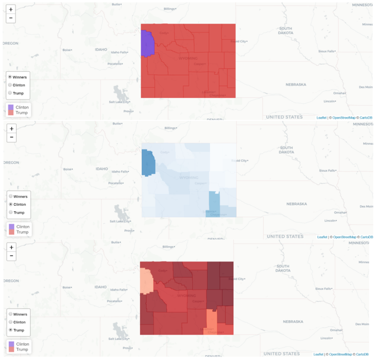

# Projects

## Election Map of Wyoming

This project is to create maps showing statistics of votes in the state of Wyoming in 2016 presidential election by using **R** and **Shiny**. The online version of the maps is available at [https://huifenzhou.shinyapps.io/project](https://huifenzhou.shinyapps.io/project). [Read more](election-map)

