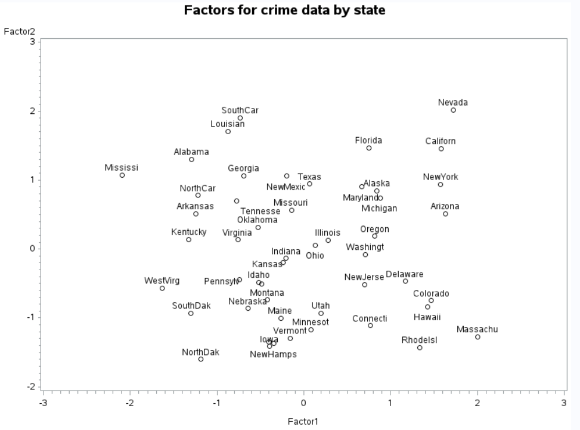
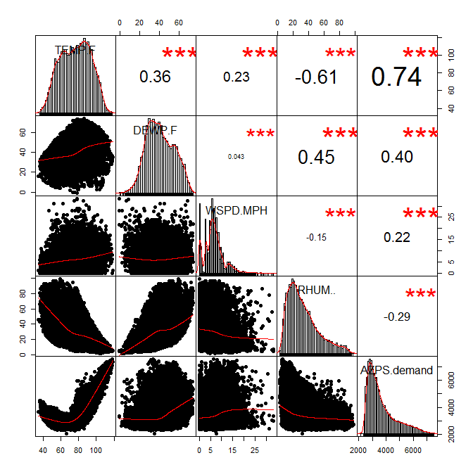

# Projects

## 1. Election Map of Wyoming

This project is to create maps showing statistics of votes in the state of Wyoming in 2016 presidential election by using **R** and **Shiny**. The online version of the maps is available at [https://huifenzhou.shinyapps.io/project](https://huifenzhou.shinyapps.io/project). [Read more](election-map)

## 2. Analysis of Factors Affecting University Ranking

University ranking plays a key role for students in determining which university to go. There are many factors affecting the ranking. It is important to identify the most important ones contributing to ranking. The findings could serve as a guide for university management and faculty members to improve their ranking. In this project, the best universities in the world and their geographical distribution are studied first by using R. Then regression models are developed to analyze variables used in rankings. It has been found that teaching, research, citations are the top 3 factors determining the ranking of a university. [Read more](university-ranking)

## 3. Multivariate Statistical Analysis of Crime Data in United States

Principal analysis, factor analysis and discriminant analysis methods are used to analyze crime data of United States. Principal analysis shows that different states have different types of crime. Factor analysis shows that larceny, auto theft and burglary can be considered as property crimes. Murder, assault and rape can be considered as violent crimes. Then criminal types of different states and areas are identified from the plot. [Read more](crime-data)

## 4. The relationship between Weather Conditions and Electricity Demand in the South of United States

In this project, in order to evaluate the level of power system risk due to abnormal load and air temperature, a statistical analysis of historical data is used. And some useful figures are plotted. [Read more](weather-electricity-demand)

