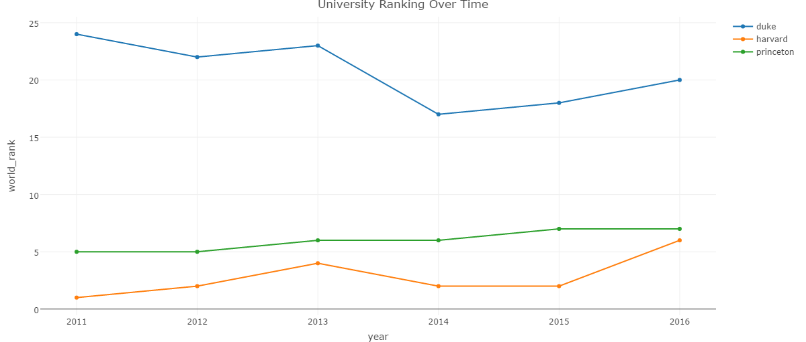
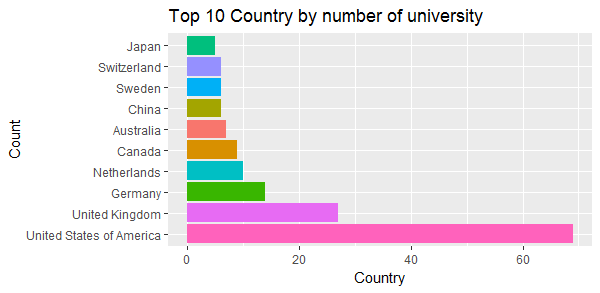

# Projects

## Analysis of Factors Affecting University Ranking

University ranking plays a key role for students in determining which university to go. There are many factors affecting the ranking. It is important to identify the most important ones contributing to ranking. The findings could serve as a guide for university management and faculty members to improve their ranking. In this project, the best universities in the world and their geographical distribution are studied first by using R. Then regression models are developed to analyze variables used in rankings. It has been found that teaching, research, citations are the top 3 factors determining the ranking of a university.

The project report can be accessed here. [https://huifenzhou.github.io/university-ranking.pdf](https://huifenzhou.github.io/university-ranking.pdf)

*The distribution of top 200 universities in the world*

*The trend of the ranking of these 3 different universities*

*TOP 10 countries by number of top 200 universities*

