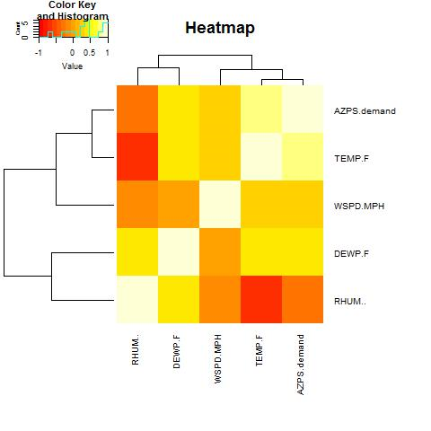
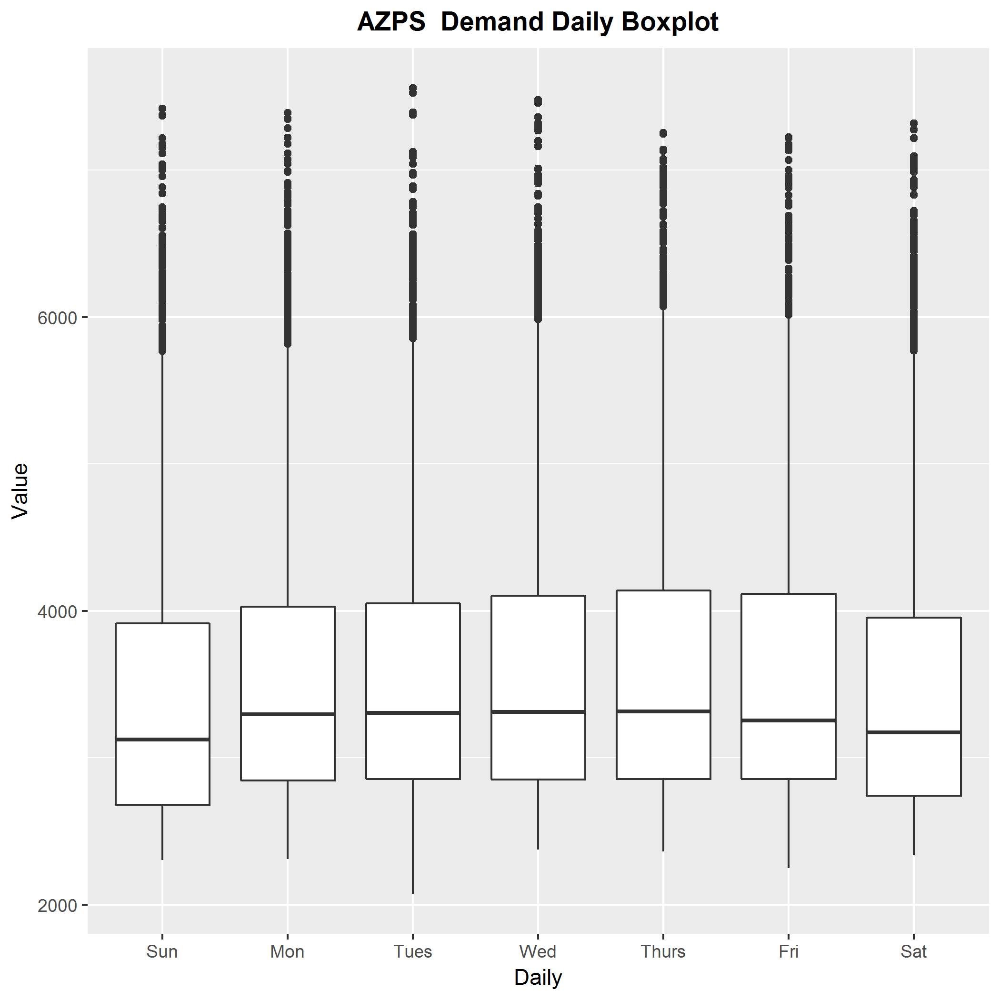

# Projects

## Multivariate Statistical Analysis of Crime Data in United States

Principal analysis, factor analysis and discriminant analysis methods are used to analyze crime data of United States.

Principal analysis shows that different states have different types of crime.

Factor analysis shows that larceny, auto theft and burglary can be considered as property crimes. Murder, assault and rape can be considered as violent crimes.

Then criminal types of different states and areas are identified from the plot.

*Correlation coefficient plot*

*Heat map*

*Boxplot*
